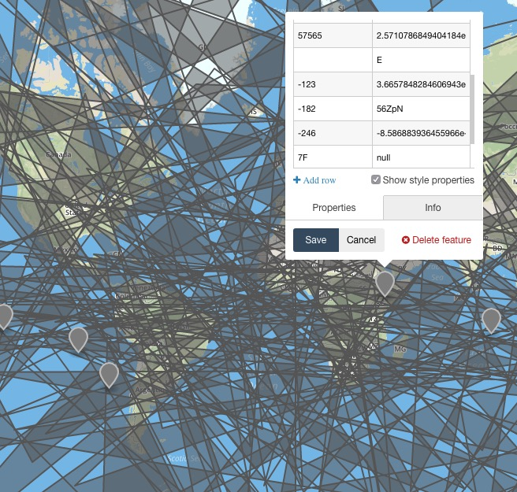

# A Hypothesis Strategy for GeoJSON

[](https://travis-ci.org/mapbox/hypothesis-geojson) 
[](https://badge.fury.io/py/hypothesis-geojson)

Generate GeoJSON data designed to expose edge cases in your code. Implemented as a custom extension of [`hypothesis`](https://github.com/HypothesisWorks/hypothesis-python) for Python testing and as a CLI.

```
pip install hypothesis-geojson
```

### What is hypothesis?

> Hypothesis is an advanced testing library for Python. It lets you write tests which are parametrized by a source of examples, and then generates simple and comprehensible examples that make your tests fail. This lets you find more bugs in your code with less work.

Hypothesis is rad; read [the manifesto](http://hypothesis.readthedocs.io/en/latest/manifesto.html)

**The key to making great maps is to test your code with ugly data**



### Design Goals

* Generate GeoJSON using a `hypothesis` [composite strategy](http://hypothesis.readthedocs.io/en/latest/data.html#composite-strategies). 
* The output must be valid [GeoJSON (RFC7946)](https://tools.ietf.org/html/rfc7946).


### Usage: CLI

The `edge-features` script let's you pipe GeoJSON features to stdout

```bash
⭆ ./edge-features 2  # optional, defaults to 10 features
{"geometry": {"type": "Point", "coordinates": [9.1806517e-317, 1.8734333207298816e-300]}, "type": "Feature", "id": 134, "properties": {}}
{"geometry": {"type": "MultiLineString", "coordinates": [[[180.0, -74.59075745399575], [-161.12031862665756, 90.0], [-89.97485098724994, -17.139247698198062]]]}, "type": "Feature", "id": "\u00a0", "properties": {"": null, "196": null, "116": -8.339789954230072e+18}}
```

### Usage: Python tests

From `test_features.py`

```python
from hypothesis import given

from hypothesis_geojson import features


def find_name(feature):
    """This silly function checks a geojson-like feature
    for the `name` property. Because `feature['properties']` is
    always a dictionary or mapping, right?

    *Most* of the time it is. But the spec allows for `null`
    which translates to a python `None` which doesn't act like
    a dict and will raise an exception.

    Would you think to test that? Hypothesis does.
    """
    # Get name property or default to empty string
    return feature['properties'].get('name', '')


# To use the hypothesis GeoJSON strategy,
# decorate the test with the @given(feautures())
@given(features())
def test_find_name(feature):
    find_name(feature)
```

Now put Hypothesis to work finding a GeoJSON feature that will break the function.

```
⭆ py.test test_features.py
...
Falsifying example: test_find_name(feature={'geometry': {'coordinates': (0.0, 0.0), 'type': 'Point'},
 'id': u'',
 'properties': None,
 'type': 'Feature'})
```

:tada: Hypothesis found the bug.


### Misc

* At some point we may want to specify more about the **aesthetics**, **geometry validity** and **spatial relationships** between the features (e.g. "Give me 10 rectangular polygons with overlapping edges in this extent").
